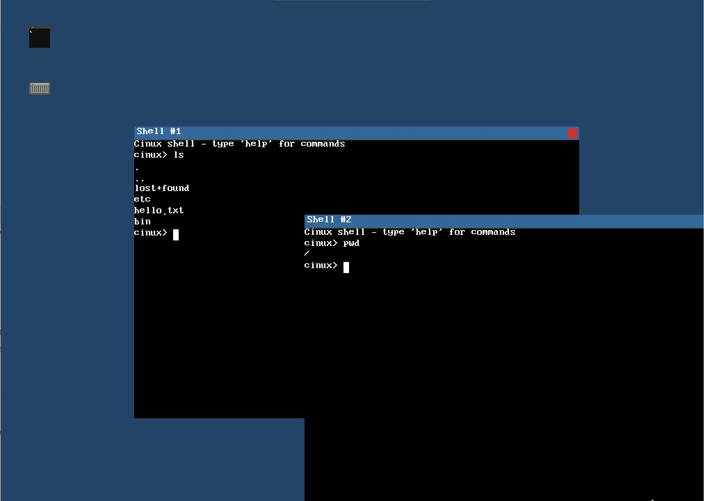
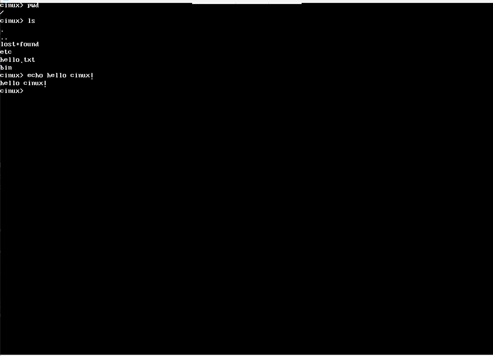
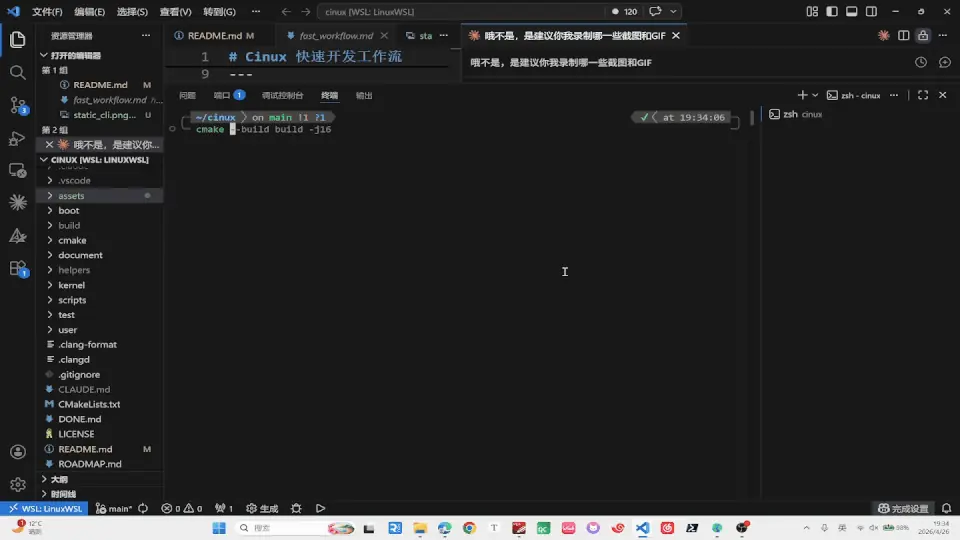
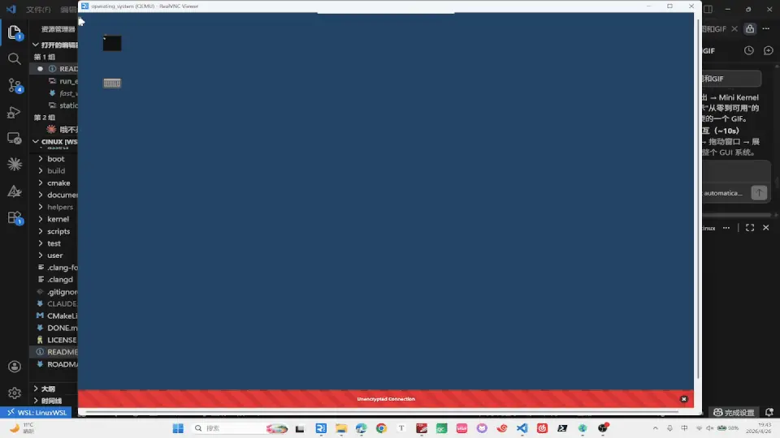
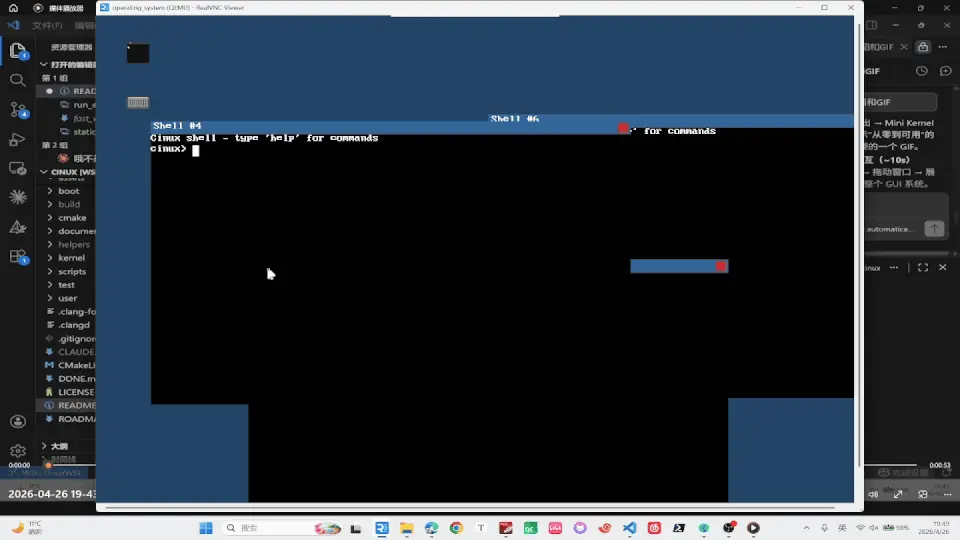
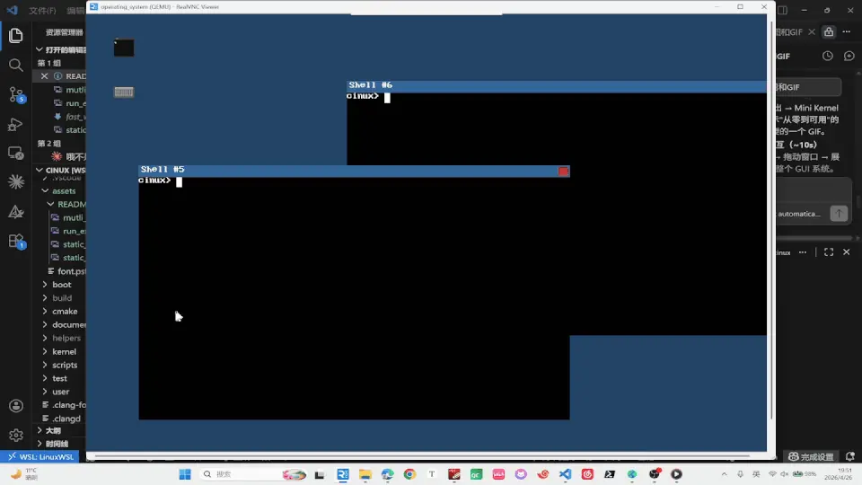

<div align="center">

# 🐧 Cinux

### 从零手搓 x86_64 操作系统 · 中文教程 · 现代 C++ 实现

[](LICENSE)
[]()
[]()
[]()
[]()

**Cinux-Book** 是一个"手把手"教你从 MBR 开始写操作系统的教程项目——从 Bootloader 到 GUI 桌面，全链路完成。Ubuntu 24.04 默认编译器即可构建，无需额外安装 GCC。也是Cinux中特性足够稳定，路径足够明细的教学版本。

> [Cinux](https://github.com/CinuxOS/Cinux) 仍然会作为更加前沿的特性, 持续活跃的开发, 甚至计划到亮起来浏览器, 和使用一些应用作为一个大里程碑!

> 笔者已经完成了一轮大重构，后续，会慢慢稳定的从Cinux正在开发的版本逐步迁移回来一些有趣的Feature!

</div>

---

## ✨ 项目简介

**Cinux** 是一个从零开始的 x86_64 操作系统开发教程，采用现代 C++ 编写。

> 💡 **为什么叫 Cinux？**
> - C/C++'s Linux, 也就是尝试重新再写一个基于C/C++的Linux
> - CharlieChen's *nux（逃）

---

## 🖼️ Screenshots

<p align="center">
  
  
</p>
<p align="center">
  <em>GUI 桌面环境（左） · CLI 终端环境（右）</em>
</p>

<p align="center">
  
  
</p>
<p align="center">
  <em>从启动到 Shell（左） · 多终端窗口（右）</em>
</p>

<p align="center">
  
  
</p>
<p align="center">
  <em>多终端并发执行（左） · Ext2 文件操作（右）</em>
</p>

---

## 🌟 特性亮点

<table>
<tr>
<td width="50%">

🧠 **完整 x86_64 内核**
Bootloader → Mini Kernel → Big Kernel → User Space → GUI 桌面，全链路打通

</td>
<td width="50%">

📁 **Ext2 文件系统读写**
VFS 抽象层 + AHCI SATA 驱动，支持 touch/mkdir/rm/cat/ls/cd/stat

</td>
</tr>
<tr>
<td>

🖥️ **GUI 桌面环境**
Canvas 双缓冲 + 窗口管理器 + PS/2 鼠标驱动，支持拖动 / Z-order / 桌面图标

</td>
<td>

⚡ **多进程 & 多终端**
fork/execve/CoW 页表复制 + Pipe IPC，每个终端绑定独立 shell 进程

</td>
</tr>
<tr>
<td>

👨‍💻 **Ring 3 用户态 Shell**
22 个系统调用，内置 echo / help / clear / ls / cat / cd / pwd / stat / mkdir / rm / touch

</td>
<td>

🧪 **测试驱动开发**
自研轻量测试框架，Host 端 mock 测试 + QEMU 集成内核测试双轨并行

</td>
</tr>
<tr>
<td>

🔧 **现代 C++17 实现**
`constexpr` 编译期生成 GDT/IDT / `concepts` 类型约束 / RAII 锁管理 / `enum class` 驱动接口 / 支持用户态内核态 SSE （故支持-O2 Release构建）

</td>
</tr>
</table>

---

## 🎯 你将学到什么

完成整个教程后，你将深入理解：

| 阶段 | 内容 | 关键技术 |
|:---:|:------|:---------|
| Phase 1 | Bootloader | 实模式 → 保护模式 → 长模式，ELF 加载，VESA 图形模式，E820 内存探测 |
| Phase 2 | 小内核（Bootstrap） | 串口 / kprintf，PMM，IDT / 异常处理，ATA PIO 磁盘，ELF 加载 |
| Phase 3 | 大内核基础设施 | GDT / IDT / 256 向量中断，PIC 重映射，PIT 时钟 |
| Phase 4 | 驱动三件套 | VGA Framebuffer + PSF2 字体，PS/2 键盘驱动，串口完善 |
| Phase 5 | 内存管理 | PMM bitmap，VMM 4 级页表，内核堆（first-fit + coalesce），独立地址空间 |
| Phase 6 | 进程与调度 | context_switch，Round-Robin 调度器，Spinlock / Mutex / Semaphore |
| Phase 7 | 用户态与系统调用 | Ring 3 切换，syscall / sysret，22 个系统调用，用户态 Shell |
| Phase 8 | 文件系统 | AHCI SATA，VFS 抽象，Ext2 读写 + 目录操作 + stat，ramdisk |
| Phase 9 | GUI 桌面环境 | Canvas 双缓冲，窗口管理器，PS/2 鼠标，拖动 / Z-order，桌面图标 |
| Phase 10 | 多进程与高级特性 | fork / execve / CoW / waitpid，Pipe IPC，多终端并发 |

---

## 🚀 快速开始

### 前置要求

本项目支持最新的 g++ 15.2编译，使用CMake构建项目，您需要安装的是

```bash
# Ubuntu/Debian
sudo apt install -y gcc g++ binutils qemu-system-x86_64 cmake
```

### 构建 & 运行

🚀🚀🚀 在WSL 或者任何您喜欢的发行版中跑起来它们！🚀🚀🚀

> Feature Help: 不知道有没有好心人愿意移植到Windows上可编译，如果有所变动欢迎提交您的PR！

#### Step 1️⃣: 配置

```bash
#  配置为GUI（默认）（Release 模式），也是最推介的！🚀
cmake -B build -DCMAKE_BUILD_TYPE=Release -S .

# 或者，默认（速度稍慢）
cmake -B build  -S .

# 或者你fork改炸了准备使用VSCode调试
cmake -B build -DCMAKE_BUILD_TYPE=Debug -S .

# 带测试的配置
cmake -B build -DCINUX_BUILD_TESTS=ON -S .

# CLI运行环境
cmake -B build -DCINUX_GUI=OFF -S .   
```

#### Step 2️⃣: 构建
```bash
cmake --build build -j$(nproc)
```

#### Step 3️⃣: Cinux，启动!

```bash
cmake --build build --target run # 跑内核本体, 默认Launch的是VNC显示，您需要VNC！
cmake --build build --target test_host           # Host 端单元测试（CTest）
cmake --build build --target run-kernel-test     # QEMU 内核测试（自动退出）
```

### 调试模式 1：GDB大牛请走这里

```bash
# 终端 1：启动 QEMU + GDB server
make run-debug

# 终端 2：连接 GDB
gdb build/kernel.elf
(gdb) target remote :1234
(gdb) break kernel_main
(gdb) continue
```

### 调试模式 2：VSCode大牛请走这里（是的别坐牢，如果不喜欢GDB!）

**Step 1：** 一键脚本构建并启动 QEMU 调试模式（Debug 构建 + GDB stub 监听 `:1234`）：

```bash
bash scripts/launch_qemu_debug.sh
```

**Step 2：** 确认 `.vscode/launch.json` 中已有如下配置：

> PS：大内核需要改一下ELF，这个麻烦自己手调。
```json
{
    "name": "QEMU 调试 (mini kernel)",
    "type": "cppdbg",
    "request": "launch",
    "program": "${workspaceFolder}/build/kernel/mini/mini_kernel",
    "MIMode": "gdb",
    "miDebuggerServerAddress": "localhost:1234",
    ...
}
```

**Step 3：** 在 VSCode 中按 **F5**，选择对应的调试配置即可开始图形化断点调试。

---

## 🛠️ 技术栈亮点

<details>
<summary><b>🔍 现代 C++ 内核开发</b></summary>

- ✅ **C++17 特性**：`constexpr` / `concepts` / `requires`
- ✅ **编译期魔法**：GDT/IDT 描述符 `constexpr` 生成，桌面图标 `constexpr` 像素数据
- ✅ **类型安全**：`enum class` 作为 API 一等公民，`concepts` 约束驱动接口
- ✅ **RAII 资源管理**：Spinlock::guard、InterruptGuard、锁自动释放
- ✅ **零标准库依赖**： freestanding，自实现 memset/memcpy/string

</details>

<details>
<summary><b>🧪 自研测试框架</b></summary>

```cpp
// 极简 API
TEST("测试名称") {
    ASSERT_EQ(actual, expected);
    ASSERT_TRUE(condition);
}

// 双轨测试策略
// Host 端：mock 硬件，验证逻辑正确性（快速迭代）
// Kernel 端：QEMU 运行，验证真实硬件行为（端到端）
```

</details>

<details>
<summary><b>📁 42 个 Git Tags 覆盖全旅程</b></summary>

每个 Milestone 完成后打 tag：`编号_大主题_小阶段`

```
000_env_toolchain          → 环境搭建
001_boot_real_mode         → 实模式启动 + VESA 图形
009_large_kernel_entry     → 大内核入口
022_ring3_usermode         → Ring 3 用户态
028_fs_ext2                → Ext2 文件系统
033_gui_desktop            → GUI 桌面环境
035_multi_terminal         → 多终端并发
...
```

共 42 个 tag，覆盖从环境搭建到多终端的完整开发历程。

</details>

---

## 🧭 在 Awesome-Embedded-Learning-Studio 中的位置

[Awesome-Embedded-Learning-Studio](https://github.com/Awesome-Embedded-Learning-Studio) 是一个面向 C++ 工程化、MCU 裸机、Embedded Linux、Qt 桌面和底层系统的一站式学习组织。[Awesome-Embedded](https://github.com/Awesome-Embedded-Learning-Studio/Awesome-Embedded) 是组织总导航，适合从那里查看完整学习地图和所有子项目。

**Cinux-Book 的定位是组织内的稳定教学版 OS 课程仓库。** 它保留 Cinux 从 boot 到 GUI、多终端的完整实现路径，并把源码、tag、教程、实验和调试笔记收束到一条适合学习的主线里。相对更前沿的 Cinux 开发线，这里更强调可复现、可讲解、可长期维护。

相关仓库可以这样理解：

| 仓库 | 定位 | 推荐入口 |
| --- | --- | --- |
| [Awesome-Embedded](https://github.com/Awesome-Embedded-Learning-Studio/Awesome-Embedded) | 组织总导航与项目索引 | 想了解整个组织的学习路线 |
| [Cinux-Book](https://github.com/Awesome-Embedded-Learning-Studio/Cinux-Book) | 稳定教学版 x86_64 OS 课程 | 想系统学习从 MBR 到 GUI 的 OS 实现 |
| [Cinux](https://github.com/Awesome-Embedded-Learning-Studio/Cinux) | 更前沿的 Cinux 开发线 | 想跟进新功能和实验性方向 |
| [Cinux-Base](https://github.com/Awesome-Embedded-Learning-Studio/Cinux-Base) | Cinux 基础组件沉淀 | 想关注可复用底层组件 |
| [PenguinLab](https://github.com/Awesome-Embedded-Learning-Studio/PenguinLab) | Linux/Embedded Linux 内核到用户态实验 | 想学习 Linux 体系内部机制 |

---

## 🤝 参与贡献

欢迎贡献！你可以：

- 🐛 修复 Bug
- ✍️ 完善文档
- 💡 提出改进建议
- 📢 分享你的学习经验

---

## 📄 许可证

本项目采用 [MIT License](LICENSE) 开源协议。

---

## 🙏 致谢

- [OSDev Wiki](https://wiki.osdev.org/) - 宝贵的 OS 开发知识库
- [Writing an OS in Rust](https://os.phil-opp.com/) - 优秀的 OS 教程参考
- 所有为开源社区贡献的开发者

---

<div align="center">

**⭐ 如果这个项目对你有帮助，请给一个 Star！**

Made with ❤️ by [CharlieChen114514](https://github.com/Charliechen114514)

</div>
